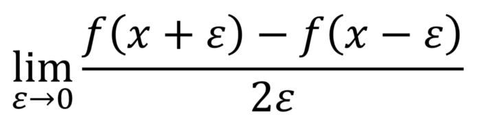
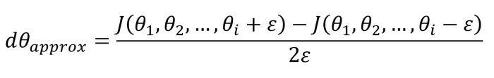
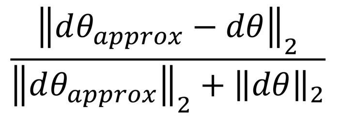

# Using Gradient - Checking to validate Back Propagation
When implementing a neural network from scratch, backpropagation is arguably where it is more prone to mistakes. Therefore, a method to debug this step could potentially save a lot of time and headaches when debugging a neural network.
Briefly, this methods consists in approximating the gradient using a numerical approach. If it is close to the calculated gradients, then backpropagation was implemented correctly!
We know that backpropagation calculates the derivatives (or gradient). From your calculus course, you might remember that the definition of a derivative is the following:

The definition above can be used as a numerical approximation of the derivative. Taking an epsilon small enough, the calculated approximation will have an error in the range of epsilon squared.
In other words, if epsilon is 0.001, the approximation will be off by 0.00001.
Therefore, we can use this to approximate the gradient, and in turn make sure that backpropagation is implemented properly. This forms the basis of gradient checking!

## Vectorized Implementation 
Now, we need to define a vectorized form of gradient checking before implementing it in Python.
Let’s take the weights and bias matrices and reshape them into a big vector theta. Similarly, all their respective derivatives will be placed into a vector d_theta. Therefore, the approximate gradient can be expressed as:

Notice how the equation above is almost identical to the definition of the limit!

Then, we apply the following formula for gradient check:

The equation above is basically the Euclidean distance normalized by the sum of the norm of the vectors. We use normalization in case that one of the vectors is very small.
As a value for epsilon, we usually opt for 1e-7. Therefore, if gradient check return a value less than 1e-7, then it means that backpropagation was implemented correctly. Otherwise, there is potentially a mistake in your implementation. If the value exceeds 1e-3, then you are sure that the code is not correct.
