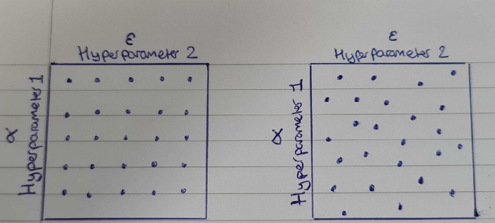
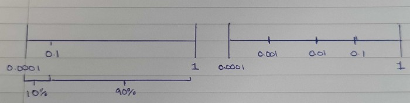

# Hyper Parameter Tuning
## Grid Search vs Random Search
Let’s say for a model we have more than one hyperparameter we are tuning, one hyperparameter probably will have more of an influence on train/validation accuracy than another hyperparameter. In this case, we may want to try a wider variety of values for the more impactful hyperparameter, but also at the same time, we don’t want to run too many models as it is time consuming.
For this example let us say we are optimising two different hyperparameters, α and ε. We know α is more important and needs to be tuned by trying out as many different values as possible. Then again you still want to try 5 different ε values as well. So, if I choose to try 5 different α values, that comes to 25 different models. We have run 25 models with different combinations of 5 α and 5 ε.
But we want to try more α values without increasing the number of models. For this, we use a random search, where we choose 25 different random values of each α and ε, and each pair of values is used for each model. Now we have to only run 25 models but we get to try 25 different values of α instead of the 5 we did in a grid search.

## Choosing a scale
When trying out different hyperparameter values, choosing the correct scale can be difficult, especially trying to make sure you thoroughly search within a range of really large numbers and a range of really small numbers. Learning rate is a hyperparameter that can vary so much based on the model, it can between 0.000001 and 0.000002, or between 0.8 and 0.9. It is very hard to search fairly between these two different ranges at once when looking at a linear scale, but we can solve this issue with using the log scale.

Let’s say we are looking at values between 0.0001 and 1 for α. Using a linear scale means 10% of the attempted α values are between 0.0001 and 0.1 and 90% between 0.1 and 1. This is bad, as we are not giving a thorough search for such a wide range of values. By using a log of 10 scale, 25% of α values are between 0.0001 and 0.001, 25% between 0.001 and 0.01, 25% between 0.01 and 0.1, and a final 25% between 0.1 and 1. This way we have a thorough search of α. The range of 0.0001 to 0.1 was 10% with a linear scale but 75% with a log scale.

