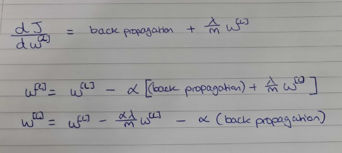

# Regularisation
Overfitting can be a huge problem with models due to high variance, this can be solved by getting more training data, but that’s not always possible, so a great alternative is regularisation.
## L2 Regularisation
Regularisation utilises one of two penalty techniques, L1 and L2, with neural networks L2 is predominantly used. Cost function is as follows

And then add the L2 penalty term, which includes the Frobenius Norm

With L2 regularisation the weight reduces not only by the learning rate and backpropagation but also by the middle term which includes the regularisation hyperparameter λ (lambda). The larger λ is the smaller w becomes.

### How does regularisation prevent overfitting

We see that L2 regularisation uses the λ penalty to reduce the weights w, but how does this reduce variance and prevent overfitting of the model?If w is small the size of z will drop too, if z is a large positive number it will become smaller, if it is a large negative number it will become larger, nearing to 0. When passing z through the activation function we have a more linear effect (as you can see the image below, the tanh curve is more linear near 0).

